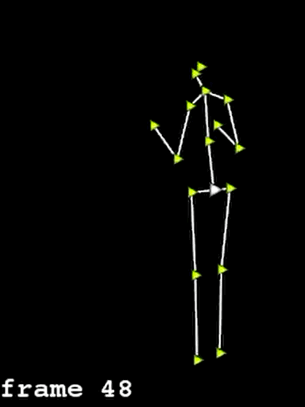
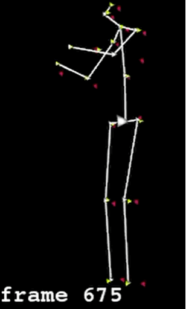

## Multi-View 3D Skeleton Fusion

### Introduction

Python scripts for multi-view 3D skeletons fusion using heatmap-weighted average. 

The 3D skeletons are obtained from state-of-art single-view 3D human pose estimation network. Single-view methods are usually suffered from occlusion thus results in inaccurate and oscillated outputs. 

To overcome this issue by leveraging multi-view information, we retrieve 2D heat map for each frame from OpenPose/HRnet and use it as confidence for merging corresponding 3D joints from multi-view. 

The oscillation and uncertainty are greatly redeemed by merging multi-view information. 

- **2-view merged output:**

- **More detailed visualization**: Red and green joins are from 2 different views and the white skeleton represents the merged results. 

### Usage
Input:

- Paths of two j3d npy file, each of them is in shape (N, 17, 3), where N is the number of frames.

Output:

- A merged j3d saved in merged.npy in the same folder.
- The shape will be (N, 17, 3)

Run:
`Python mmview-merge.py`
